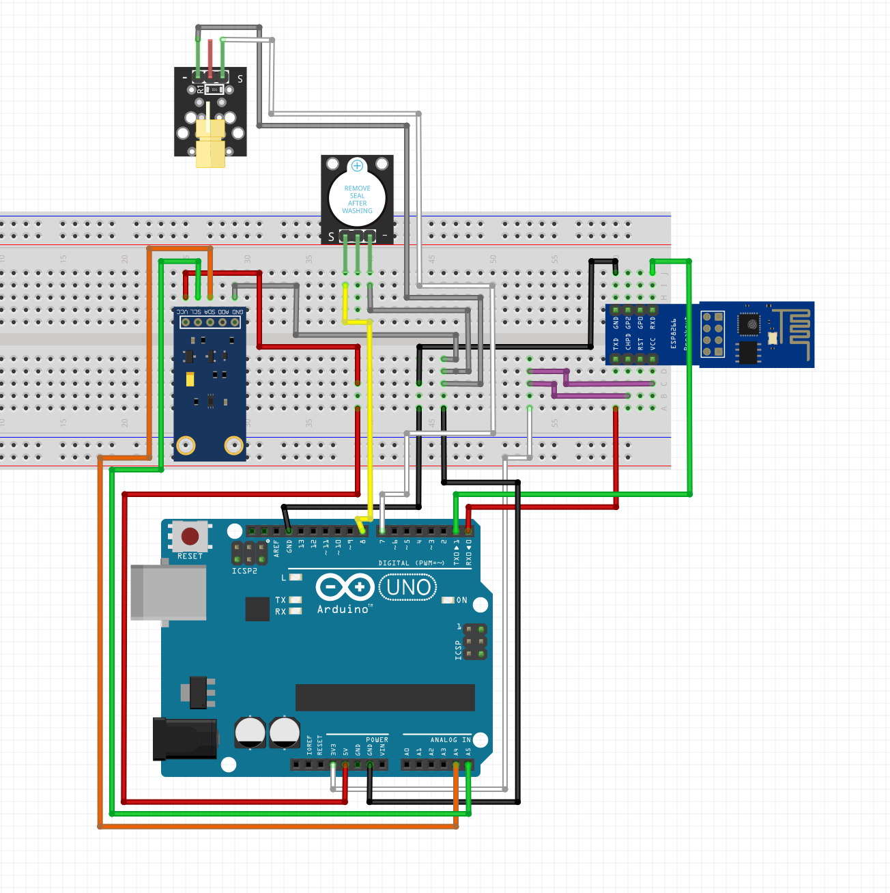

# group-15-final-arduino-project
//https://github.com/Tech-Trends-Shameer/Esp-8266-Projects/blob/main/Temperature-Alert-Notification-Using-Blynk-IOT/temperature-alert-notification-using-blynk-iot.ino
This is our tripwire design with wifi using esp8266-01s
